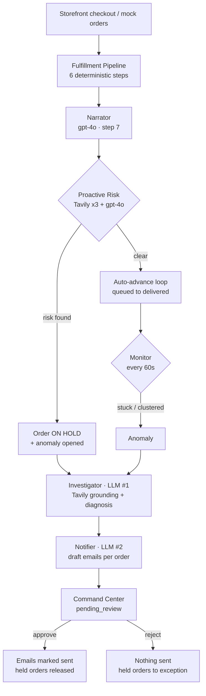

# FulfillAI

A simulated 3PL / e-commerce fulfillment operations platform where autonomous agents watch shipments, diagnose delivery problems against live web search, and draft customer apology emails — **but never send one without a human clicking approve.**

Brands onboard products and per-warehouse inventory. Customers check out on a storefront. A deterministic routing pipeline picks the fulfillment center and carrier. From there, AI agents take over: they detect stuck or clustered shipments, ground a root-cause diagnosis in real Tavily search results, and queue personalized delay emails in a Command Center for ops review.

**▶ [Watch the demo](https://www.loom.com/share/efc61f5741834215a2c7b88dce815c9e)** — full walkthrough: brand onboarding, a live order routing through the pipeline, and an anomaly going from detection to a drafted customer email in the Command Center.

<!-- Optional still image: drop a screenshot of the Command Center at docs/screenshot.png and uncomment. -->
<!--  -->

---

## How it works

1. **Onboard a brand** in the Brands tab — products, and inventory split across the four seeded fulfillment centers.
2. **An order arrives**, either from the customer storefront at `/shop` or the "+ Mock Orders (5)" simulator.
3. **The Fulfillment Pipeline** ([agents/fulfillment.py](fulfillai/agents/fulfillment.py)) runs six deterministic steps: availability check → FC selection → shipping cost → priority scoring → edge-case detection → finalize (reserve inventory, create shipment, assign queue position).
4. **The Narrator** writes a one-sentence plain-English explanation of *why* the order routed that way, logged as step 7 of the trace.
5. **The Proactive Risk agent** searches for weather/carrier/facility trouble on that specific route *before* the package ships. On a medium- or high-confidence risk it opens an anomaly and puts the order **on hold**.
6. **The auto-advance loop** walks orders through `queued → picking → packing → shipped → in_transit → delivered`, skipping anything on hold.
7. **The Monitor** scans every 60 seconds for shipments stuck past 4 hours, and clusters them by fulfillment center, carrier, or destination region.
8. **The Investigator** (LLM call #1) pulls Tavily results for the anomaly's scope and returns a JSON root-cause diagnosis where every evidence bullet carries a citation.
9. **The Notifier** (LLM call #2) drafts one personalized delay email per affected order, in parallel.
10. **Ops reviews** in the Command Center — approve, reject, edit a draft, or send it back for re-investigation.

By the time a human opens the Command Center, the anomaly is already sitting in `pending_review` with a full diagnosis and drafted emails attached.



### Two design guarantees

**Grounding guardrail.** If Tavily returns nothing to reason over, the Investigator's confidence is forced down to `low` regardless of what the model claims ([agents/investigator.py:189-191](fulfillai/agents/investigator.py#L189-L191)). Cited URLs are also filtered against the actual grounding set, so the model cannot invent a source. No Tavily key at all? Searches return `[]` and every diagnosis lands as low-confidence rather than confidently wrong.

**Human in the loop.** Every notification is written to the DB as `status='draft'`. Approving an anomaly marks its drafts sent and releases any held orders; rejecting sends nothing and flips held orders to `exception`. There is no code path where an LLM-authored message reaches a customer without an ops click.

---

## The agents

Seven distinct `agent_name` values are written into the `agent_actions` trace:

| Agent | File | AI? | Role |
|---|---|---|---|
| `pipeline` | [agents/fulfillment.py](fulfillai/agents/fulfillment.py) | No | 6 deterministic routing steps; distance-multiplier shipping cost, tier-aware carrier choice |
| `narrator` | [agents/narrator.py](fulfillai/agents/narrator.py) | gpt-4o | ≤35-word explanation of the routing decision (step 7). Templated fallback; never raises |
| `proactive_risk` | [agents/proactive_risk.py](fulfillai/agents/proactive_risk.py) | Tavily ×3 + gpt-4o | Pre-ship route risk on destination / carrier / origin FC. Creates an anomaly and sets `on_hold=True`. Fail-safe: any error ⇒ `has_risk=False` |
| `monitor` | [agents/monitor.py](fulfillai/agents/monitor.py) | No | Pure SQL + Python. Stuck detection (`STUCK_AFTER_HOURS = 4`) and clustering (`CLUSTER_MIN = 3`), with dedup against open anomalies |
| `investigator` | [agents/investigator.py](fulfillai/agents/investigator.py) | Tavily + gpt-4o | **LLM #1** — JSON diagnosis: likely cause, reasoning, evidence bullets with `internal:` / `source:` citations, confidence, recommended action, customer impact |
| `notifier` | [agents/notifier.py](fulfillai/agents/notifier.py) | gpt-4o | **LLM #2** — per-order draft emails fanned out with `asyncio.gather`. Canned fallback sets `is_fallback=True` |
| `ops_review` | [routes/anomalies.py](fulfillai/routes/anomalies.py) | Human | Approve / reject / edit draft / re-investigate |

Both LLM agents go through `_call_openai_with_retry` in [agents/base.py:26-48](fulfillai/agents/base.py#L26-L48) — model hardcoded to `gpt-4o`, 3 attempts, exponential backoff from 1.0s.

### Anomalies

Lifecycle: `detected → investigating → diagnosed → drafting → pending_review → resolved | rejected`. Re-investigating loops back to `investigating`.

| Type | Trigger |
|---|---|
| `cluster_delay` | 3+ stuck shipments sharing a region |
| `single_stuck` | One shipment past the stuck threshold |
| `carrier_issue` | Stuck shipments clustered on one carrier |
| `fc_issue` | Stuck shipments clustered on one fulfillment center |
| `proactive_route_risk` | ⏸ Pre-ship risk found by the risk agent |
| `split_shipment_review` | ⏸ Order needs splitting across FCs |
| `backorder_review` | ⏸ Insufficient fulfillable inventory |

⏸ = member of `HOLD_ANOMALY_TYPES` ([routes/anomalies.py:191](fulfillai/routes/anomalies.py#L191)) — these block their orders from advancing until ops acts.

---

## Quickstart

```bash
git clone <repo-url>
cd Ship_Anomalies_Agent/fulfillai

python -m venv .venv
.venv\Scripts\activate          # Windows
# source .venv/bin/activate     # macOS / Linux

pip install -r requirements.txt
# create fulfillai/.env — see Environment below

uvicorn main:app --reload --port 8000
```

> **You must `cd fulfillai` first.** [main.py:5](fulfillai/main.py#L5) does `sys.path.insert(0, ...)` and all imports are bare (`from agents...`, `from routes...`). Running `uvicorn fulfillai.main:app` from the repo root will fail on import.

| | |
|---|---|
| Ops portal | http://localhost:8000/ |
| Customer storefront | http://localhost:8000/shop |
| API docs (auto) | http://localhost:8000/docs |

**First run.** The DB is created and seeded automatically on startup — but the seed only inserts infrastructure: 4 fulfillment centers (`NYC-FC`, `DAL-FC`, `CHI-FC`, `LA-FC`) and 3 carriers (UPS, FedEx, USPS, three service tiers each). Brands, products, and orders start empty. Onboard a brand in the **Brands** tab, add products and inventory, then either check out at `/shop` or hit **+ Mock Orders (5)** in the sim bar. Both background loops start with the app; the first anomaly scan runs 5 seconds after boot.

---

## Environment

Create `fulfillai/.env` (gitignored):

```env
OPENAI_API_KEY=sk-...
TAVILY_API_KEY=tvly-...
```

| Variable | Required | Read at | If missing |
|---|---|---|---|
| `OPENAI_API_KEY` | **Yes** | [agents/base.py:14-18](fulfillai/agents/base.py#L14-L18) | `RuntimeError` at import — the app will not start |
| `TAVILY_API_KEY` | No | [agents/tavily_client.py:20](fulfillai/agents/tavily_client.py#L20) | Searches return `[]`; every diagnosis is recorded as low-confidence instead of ungrounded |

---

## Tech stack

**Backend** — FastAPI + uvicorn, SQLAlchemy 2.0 ORM over SQLite, Server-Sent Events for the live activity feed, `httpx` for Tavily, `openai` async client for gpt-4o. Python 3.10+ (PEP 604 unions throughout).

**Frontend** — no build step, no npm. Two standalone HTML files using React 18 UMD + Babel Standalone (in-browser JSX) + Tailwind via CDN.

```
requirements.txt
├── fastapi>=0.111.0
├── uvicorn[standard]>=0.29.0
├── openai>=1.30.0
├── python-dotenv>=1.0.0
├── sqlalchemy>=2.0.0
└── httpx>=0.27.0
```

### Layout

```
fulfillai/
├── main.py             # FastAPI app, router wiring, startup hooks, static UI routes
├── database.py         # SQLAlchemy engine + SessionLocal, SQLite at fulfillai/fulfillai.db
├── models.py           # 13 ORM models
├── seed.py             # Seeds fulfillment centers + carriers only
├── index.html          # Ops portal SPA — Brands / Operations / Command Center / Activity Log
├── shop.html           # Customer storefront SPA
├── requirements.txt
├── agents/
│   ├── base.py         # OpenAI client, retry wrapper, log_agent_action + SSE broadcast
│   ├── background.py   # The two startup loops: anomaly monitor + queue auto-advance
│   ├── fulfillment.py  # Deterministic 6-step routing pipeline
│   ├── narrator.py     # gpt-4o routing explanation (step 7)
│   ├── proactive_risk.py # Pre-ship route risk, can hold an order
│   ├── monitor.py      # Stuck/cluster detection, no AI
│   ├── investigator.py # LLM #1 — grounded root-cause diagnosis
│   ├── notifier.py     # LLM #2 — draft customer emails
│   └── tavily_client.py # Tavily wrapper + query builder + 2h cache
└── routes/
    ├── brands.py       # Brand onboarding, products, inventory
    ├── storefront.py   # Public catalog + checkout
    ├── orders.py       # Order list, stats, full agent decision trace
    ├── fulfillment.py  # Process order, advance queue, FC/queue views
    ├── anomalies.py    # Anomaly + notification review workflow
    ├── activity.py     # SSE feed + history
    ├── explorer.py     # Raw DB browser for the UI
    └── simulation.py   # Mock orders, force-advance, reset
```

---

## API

**Brands** — `/api/brands`

| Method | Path | Purpose |
|---|---|---|
| GET | `/api/brands` | List brands |
| POST | `/api/brands` | Create a brand |
| GET | `/api/brands/{brand_id}` | Brand detail with products + inventory |
| POST | `/api/brands/{brand_id}/activate` | Flip `onboarding` → `active` |
| POST | `/api/brands/{brand_id}/products` | Add a product |
| DELETE | `/api/brands/{brand_id}/products/{product_id}` | Remove a product |
| POST | `/api/brands/{brand_id}/inventory` | Set per-FC inventory |

**Storefront** — `/api/storefront`

| Method | Path | Purpose |
|---|---|---|
| GET | `/api/storefront/catalog/{brand_id}` | Public product catalog |
| POST | `/api/storefront/checkout` | Place an order, kicks off the pipeline |

**Orders** — `/api/orders`

| Method | Path | Purpose |
|---|---|---|
| GET | `/api/orders` | List orders |
| GET | `/api/orders/stats` | Dashboard counters |
| GET | `/api/orders/{order_id}` | Order detail + full agent decision trace |

**Fulfillment** — `/api/fulfillment`

| Method | Path | Purpose |
|---|---|---|
| POST | `/api/fulfillment/process/{order_id}` | Run the pipeline on one order |
| POST | `/api/fulfillment/advance-queue?count=5` | Advance the queue, respecting holds |
| GET | `/api/fulfillment/centers` | FCs with inventory + load |
| GET | `/api/fulfillment/queue` | Current queue in priority order |

**Anomalies & notifications** — `/api`

| Method | Path | Purpose |
|---|---|---|
| GET | `/api/anomalies?status=` | List anomalies, optionally filtered |
| GET | `/api/anomalies/{anomaly_id}` | Full diagnosis, sources, and drafts |
| POST | `/api/anomalies/scan-now` | Run one monitor→investigate→draft cycle immediately |
| POST | `/api/anomalies/{anomaly_id}/approve` | Send all drafts, release held orders |
| POST | `/api/anomalies/{anomaly_id}/reject` | Send nothing; held orders → `exception` |
| POST | `/api/anomalies/{anomaly_id}/re-investigate` | Re-run the Investigator, optionally with ops context |
| PATCH | `/api/notifications/{notif_id}` | Edit a draft's subject/body |
| POST | `/api/notifications/{notif_id}/approve-send` | Approve one email individually |
| POST | `/api/notifications/{notif_id}/reject` | Reject one email individually |

**Activity, explorer, simulation**

| Method | Path | Purpose |
|---|---|---|
| GET | `/api/activity/feed` | SSE stream of agent actions (30s keepalive) |
| GET | `/api/activity/history` | Recent agent actions |
| GET | `/api/explorer/schema` | Table list + columns |
| GET | `/api/explorer/tables/{table_name}` | Raw rows |
| GET | `/api/explorer/stats` | Row counts |
| POST | `/api/simulate/mock-orders?count=5&brand_id=` | Generate synthetic orders |
| POST | `/api/simulate/advance-queue?count=5` | Force-advance, **ignoring holds** (debug) |
| POST | `/api/simulate/reset` | Drop everything and reseed |

---

## Data model

13 tables in [models.py](fulfillai/models.py):

| Table | Purpose |
|---|---|
| `brands` | Onboarded merchants (`onboarding` / `active` / `paused`) |
| `fulfillment_centers` | Warehouses with city/state/region |
| `products` | SKU, category, weight, price |
| `inventory` | Per product × FC: onhand / fulfillable / reserved |
| `carriers` | Carriers with a JSON list of service tiers |
| `orders` | Status, shipping tier, VIP flag, priority score, queue position, hold flags, narrator explanation |
| `order_items` | Line items |
| `shipments` | FC + carrier assignment, tracking, cost, ETA |
| `shipment_events` | Tracking scan history |
| `agent_actions` | The decision trace — every agent step, also the source of the live activity feed |
| `anomalies` | Detection, Tavily grounding, LLM diagnosis, review outcome |
| `notifications` | Customer emails: `draft → approved → sent \| rejected` |
| `tavily_cache` | Cached search results keyed by destination / carrier / origin |

Order status flow: `pending → queued → picking → packing → shipped → in_transit → delivered`, plus `backorder` and `exception`.

---

## Tuning constants

| Constant | Value | File |
|---|---|---|
| `SCAN_INTERVAL_SECONDS` | 60 | `agents/background.py` |
| `STARTUP_DELAY_SECONDS` | 5 | `agents/background.py` |
| `QUEUE_ADVANCE_INTERVAL_SECONDS` | 30 | `agents/background.py` |
| `QUEUE_ADVANCE_BATCH_SIZE` | 10 | `agents/background.py` |
| `STALE_PENDING_SECONDS` | 45 | `agents/background.py` |
| `STALE_PENDING_BATCH_SIZE` | 20 | `agents/background.py` |
| `CLUSTER_MIN` | 3 | `agents/monitor.py` |
| `STUCK_AFTER_HOURS` | 4 | `agents/monitor.py` |
| `CACHE_TTL_SECONDS` | 7200 | `agents/tavily_client.py` |
| `REQUEST_TIMEOUT` | 12.0 | `agents/tavily_client.py` |

---

## Known limitations

- **No Alembic.** Schema changes require: stop the server → delete `fulfillai/fulfillai.db` → restart. SQLite holds a lock while uvicorn runs, so stopping first is mandatory ([models.py:1-3](fulfillai/models.py#L1-L3)). `seed_if_empty()` repopulates FCs and carriers; brands, products, and orders are lost.
- **Emails are simulated.** Approving marks a notification `sent` in the DB. Nothing is handed to an SMTP server.
- **Deprecation warnings.** `@app.on_event("startup")` is deprecated in current FastAPI (lifespan handlers are the replacement), and `db.query(Model).get(id)` is legacy SQLAlchemy 1.x style. Dependencies are pinned with `>=`, so both will warn on fresh installs.
- **CORS is wide open** (`allow_origins=["*"]`) — fine for a local demo, not for anything deployed.
- **No tests, no Dockerfile, no CI.**
- Shipping costs, distances, and transit delays are modeled with region multipliers, not real carrier rate cards.
